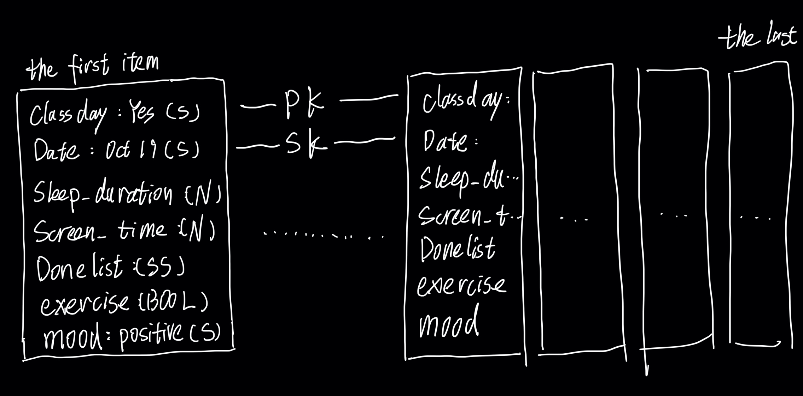
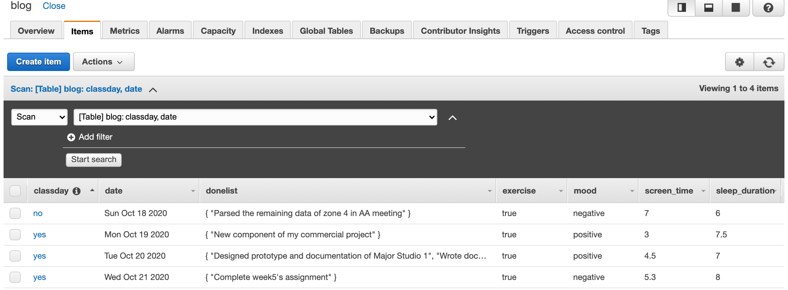

# Weekly Assignment 5

We need to generate the raw data for the "Process Blog" project (the data source for [Final Assignment 2](https://github.com/visualizedata/data-structures/blob/master/final_assignment_2.md)). This week, we are basically establish the template for our data.

## Process

### Data Model



### Create some data for the table in your database

I plan to use this blog to surveil my life. The partition key is `classday`, which represents whether there is a class today or not. And I chose `date` to be my sort key. But I believe the sort key is optional here because we have opportunities to reconstruct the 'table' by selecting the sort key when we need to make queries.

```javascript
var blogEntries = [];

class BlogEntry {
  constructor(classday, date, sleep_duration, screen_time, donelist, exercise, mood) {
    this.classday = {};
    //this.classday.BOOL = classday.toString();
    this.classday.S = classday;
    
    this.date = {}; 
    this.date.S = new Date(date).toDateString();
    
    this.sleep_duration ={};
    this.sleep_duration.N = sleep_duration.toString()

    this.screen_time ={};
    this.screen_time.N = screen_time.toString()
    
    if (donelist != null) {
      this.donelist = {};
      this.donelist.SS = donelist; 
    }
    
    this.exercise = {};
    this.exercise.BOOL = exercise;
    
    this.mood = {};
    this.mood.S = mood;

  }
}

blogEntries.push(new BlogEntry('no', 'October 18 2020', 6, 7, ["Parsed the remaining data of zone 4 in AA meeting"], true, "negative"));
blogEntries.push(new BlogEntry('yes', 'October 19 2020', 7.5, 3, ["New component of my commercial project"], true, "positive"));
blogEntries.push(new BlogEntry('yes', 'October 20 2020', 7, 4.5, ["Designed prototype and documentation of Major Studio 1", "Wrote documentation for data structures class"], true, "positive"));
blogEntries.push(new BlogEntry('yes', 'October 21 2020', 8, 5.3, ["Complete week5's assignment"], true, "negative"));
```

### Populate the database

I need my code to populate all the items in the `blogEntries` array. I use the `async.eachSeries` module in Node.js to deal with the loop. In each iteration, I use the [`putItem`](https://docs.aws.amazon.com/AWSJavaScriptSDK/latest/AWS/DynamoDB.html#putItem-property) in [AWS SDK]((https://docs.aws.amazon.com/AWSJavaScriptSDK/latest/)) to put the Item into the DynamoDB table (from the `blogEntries` array created in the previous step).  

```javascript
const async = require('async');

var AWS = require('aws-sdk');
AWS.config = new AWS.Config();
AWS.config.region = "us-east-2";

var dynamodb = new AWS.DynamoDB();

async.eachSeries(blogEntries, function(entry, callback) {
      
      var params = {};
      params.Item = entry; 
      params.TableName = "blog";
      
      dynamodb.putItem(params, function (err, data) {
      if (err) console.log(err, err.stack); // an error occurred
            else     
            console.log(entry);           // successful response
      });
      
    setTimeout(callback, 500);
});
```

At the beginning, I did not set a timeout(I just thought that this is not a query for API, the timeout may be superfluous), and I found that it only write the first entry in my array to the database. Then I `setTimeout(callback, 500);`, it worked. I also searched this issue, and I learned that there must be a `callback()` in the end of the function.

### Check the database
