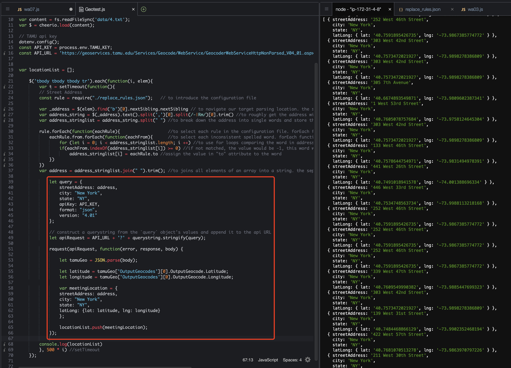

# Weekly Assignment 7

Finish parsing and cleaning the rest of the data in "zone 4" and all other zones, and update/replace my PostgreSQL table(s) with the new data. This would include **all the data** I may need for the final map in Final Assignment 1.

## Workflow

### Step 1 Parsing the HTML File

In Weekly Assignment 2, I parsed limited addresses data in Zone 4 of AA meetings. In this step, I will parse the rest of the data in [4.txt](/Weekly_assign_01/data/4.txt).

#### Examining the HTML Structure
```HTML
<table>
    <table>
        <table>
            <tbody>
                <tr>
                    <td>location data</td>
                    <td>time, type and interest information</td>
                    <td>meeting id</td>
                </tr>

                <tr>
                    <td>location data</td>
                    <td>time, type and interest information</td>
                    <td>meeting id</td>
                </tr>
                ……

            </tbody>
        </table>
    </table>
</table>
```
#### Determining the Data Model

I continue to use the data model that I created in [weekly assignment 4](https://github.com/gitacoco/data-structures/tree/master/Weekly_assign_04). So there will be two tables: `Location List` and `Time List`. And we can rely on the composite key to extract meeting information efficiently.

#### Parsing the file

The code please refer to [wa07_Parse.js](https://github.com/gitacoco/data-structures/blob/master/Weekly_assign_07/wa07_Parse.js). The basic workflow: 
1. I defined two parallel arrays: `var locationList = [];` and `var timeList = [];`
2. Navigate to our target HTML tags. **There is a hateful pitfall here!** When I was examining the HTML file, I found there is only one pair of `<tbody></tbody>` tag. So I wrote `$('tbody tr')` in the selector. When I finished my code, it did not work at all. I started the tough voyage of debugging. I printed each step reversely, finally found the problems is from this step. **There are two pairs of invisible `<tbody></tbody>`. This would be elaborated in the last part of this documentation.
3. Run an each function to parse the address data.
4. Run an nested each function to parse the time data.

#### Outcome of Zone 4
Here comes the results from my console:

1. **the location table example**

```JS
{ meetingID: '302',
    streetAddress: '484 West 43rd Street',
    buildingName: 'Manhattan Plaza Health Club',
    roomFloor: '1st Floor',
    city: 'New York',
    state: 'NY',
    zipCode: '10036',
    detailsBox: 'Fri=Living Sober, Sat=Promises',
    wheelChair: true },
```

2. **the time table with type and special interest information example**

Meeting ID here is the foreign key of the time table. And there would be a new attribute, which would be generated automatically in database management systems, assigned for each time item as a primary key.
```JS
  { meetingID: '62',
    day: 'Mondays',
    startTime: '12:00 PM',
    endTime: '1:00 PM',
    meetingType: 'Closed Discussion meeting',
    specialInterest: 'N/A' },
  { meetingID: '62',
    day: 'Wednesdays',
    startTime: '12:00 PM',
    endTime: '1:00 PM',
    meetingType: 'Closed Discussion meeting',
    specialInterest: 'N/A' },
  { meetingID: '62',
    day: 'Fridays',
    startTime: '12:00 PM',
    endTime: '1:00 PM',
    meetingType: 'Closed Discussion meeting',
    specialInterest: 'N/A' },
```

#### External Reference File for Exceptions

To avoid excessive exceptions in the JavasScript file, we could establish an external reference library through JSON format. This could strip rules from JS code. And then the readability of the JS file and the maintainability of the rules will be better. (This is a strategy for optimization with a low priority)

Example Code:
The configuration file:
```JSON
[
  {"from": ["St", "St.","STREET","Street."],"to": "Street"},
  {"from": ["Blvd."],"to": "Blvd"},
  {"from": ["W.", "W", "west"],"to": "West"},
  {"from": ["E", "E.", "EAST"],"to": "East"},
  {"from": ["37TH"],"to": "37th"},
  {"from": ["@", "&"],"to": "and"},
  {"from": ["West165th"],"to": "West 165th"},
  {"from": ["Church.","Church)"],"to": "Church"},
  {"from": ["thru"],"to": "through"},
  {"from": ["NY","\n\t\t\t\t\t\tNY"],"to": " "},
  {"from": ["(Basement)"],"to": " "},
  {"from": ["Basment","basement."],"to": "Basement"},
  {"from": ["(Red Door"],"to": " "},
  {"from": ["FL.", "Fl.", "floor"],"to": "Floor"},
  {"from": ["(Room","room."],"to": "Room"},
  {"from": ["rear.","rear"],"to": "Rear"},
  {"from": ["."],"to": " "},
  {"from": ["(2nd"],"to": "2nd"},
  {"from": ["Door)"],"to": "Door"},
  {"from": ["(In"],"to": "In"},
  {"from": ["gym)"],"to": "Gym"},
  {"from": ["event"],"to": "Event"}
]
```
Here comes the corresponding code. This version is only available for strings but not regular expressions.
```JS
 const rule = require("./replace_rules.json");   // to introduce the configuration file
        
        var _address = $(elem).find('b')[0].nextSibling.nextSibling // to navigate our target parsing location. the same way as before
        var address_string = $(_address).text().split(',')[0].split(/- |Rm|Meeting/)[0].split('(Red')[0].trim() //to roughly get the address with some inconsistent spelled words
        var address_stringlist = address_string.split(" ") //to break down the address into single words and store them in array
        
        rule.forEach(function(eachRule){                   //to select each rule in the configuration file. forEach function here will iterater each rule 
            eachRule.from.forEach(function(eachFrom){      //to select each inconsistent spelled word. forEach function here will iterater each word in the "from" array 
                for (let i = 0; i < address_stringlist.length; i ++){ //to use for loops comparing the word in address_stringlist with the word from "from" array in the configuration file one by one
                if(eachFrom === address_stringlist[i]){ //if not matched, the value would be -1, this word would be skipped. if matched, the value would large than 0, then
                    address_stringlist[i] = eachRule.to //assign the value in "to" attribute to the word
                }
              }    
            })
        })
        var address = address_stringlist.join(" ").trim(); //to joins all elements of an array into a string. the separator here is a space
```

#### Other Zones One by One

> it's wise to approach them all as ten separate zones, not try to do all of that in the same script but then leads to disparate JSON files to all bring back together. ———— Aaron Hill

Currently, we need to manually revise the target zone's number to parse it one by one. But for all zone, we use a consistent rule file. My work flow is to parse my zone first, continue to parse all other zones individually and supplement the rules at the same time, merge them together in one file respectively for location and time data, and then geocode the location data.

### Step 2 Stitching All Ten Zones Together

[Lee Kuczewski](https://github.com/leeallennyc/data-structures-fall-2020/tree/master/week7) contributes the following code to merge all individual zones together:
```JS
"use strict"
// dependencies
const fs = require('fs'),
      querystring = require('querystring'),
      request = require('request'),
      async = require('async'),
      dotenv = require('dotenv'),
      path = require('path');
// Combining Location Lists
var filenamesLocation = fs.readdirSync(`${__dirname}/data/locationLists`);
for (let i = 0; i<filenamesLocation.length; i++){
    var mergedLocations = JSON.parse(fs.readFileSync(`${__dirname}/data/locationLists/${filenamesLocation[i]}`));
    console.log(mergedLocations);
};
```
But the thing is, in the merged file, each zone is still wrapped in its own array.

### Step 2 Geocoding the Data 

1. Alternative 1: Geocoding while Parsing

I tested a way to parse the data and geocode it simultaneously. It really works. But I'll still geocode the data after I get all the cleaned data because I can check the data first before geocoding and ensure that the data is clean enough.



2. Alternative 2: Geocoding after Parsing

### Step 3 Populate the Database

### Thoughts, Debugging and Lesson Learned

1. Some Thoughts on the Exceptions and Data Integrity

What is the border of data cleaning? What is the bottom line of data integrity? Do we have to standardize all the data in a UGC meeting information sharing platform (I assume AA Meeting is UGC)?

Take Google Calendar as an example, anyone could invite me to join an event. Let's take a closer look at the event-creating panel. 
1. The **meeting name** is totally written by users. 
2. The **time** is determined by users in limited freedom. You cannot type something. The only thing you can do is to pick a day and/or a time slot in their ‘prefabricated components’.
3. For the **address** information, the blank(you need to fill in) is an input box as well as a search engine. They have features like computer-assisted address association and map-based localization to help your data in good order. However, if you just want to input something in a mess, they won't interfere you.

I think the ranking of freedom of these three information input mechanisms is 1>3>2, and the level of data consistency tends to be 2>3>1. Apparently, the strategies towards the management of different data types should depend on something(I have no idea so far). At least, more strict does not necessarily mean better. This is supposed to be case by case.