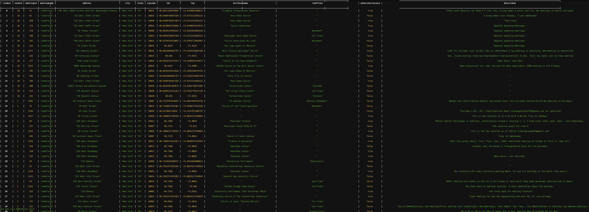
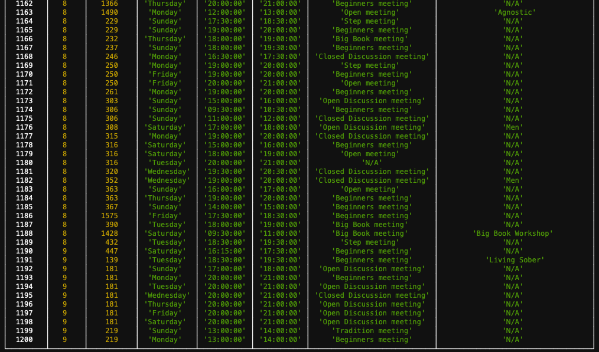

# Weekly Assignment 7

Finish parsing and cleaning the rest of the data in "zone 4" and all other zones, and update/replace my PostgreSQL table(s) with the new data. This would include **all the data** I may need for the final map in Final Assignment 1.

## Features Overview

- [x] Cleaning the data 100% through code
- [x] Hybrid strategies and multiple methods introduced for the exceptions
- [x] An external reference file for most of the exceptions in 10 zones to keep the script neat
- [x] Fully automated data parsing for all 10 zones
- [x] Merge the data of individual zones through the native method of the JavaScript Array
- [x] 100% geocoded for all location data
- [x] Location and time data are distributed in two PostgreSQL tables respectively

## Workflow

### STEP 1: Parsing the HTML File

In Weekly Assignment 2, I parsed limited addresses data in Zone 4 of AA meetings. In this step, I will parse the rest of the data in [4.txt](/Weekly_assign_01/data/4.txt).

#### Examining the HTML Structure
```HTML
<table>
    <table>
        <table>
            <tbody>
                <tr>
                    <td>location data</td>
                    <td>time, type and interest information</td>
                    <td>meeting id</td>
                </tr>

                <tr>
                    <td>location data</td>
                    <td>time, type and interest information</td>
                    <td>meeting id</td>
                </tr>
                ……

            </tbody>
        </table>
    </table>
</table>
```
#### Determining the Data Model

I continue to use the data model that I created in [weekly assignment 4](https://github.com/gitacoco/data-structures/tree/master/Weekly_assign_04). So there will be two tables: `Location List` and `Time List`. And we can rely on the composite key to extract meeting information efficiently.

#### Parsing the file

The code please refer to [wa07_Parse.js](https://github.com/gitacoco/data-structures/blob/master/Weekly_assign_07/parse.js). My workflow is to parse my zone first, then continue to test all other zones individually and supplement the rules at the same time, then parse them automatically through a `for loop`, then merge them together in one file respectively for location and time data, and then geocode the location data.

For my zone data:
1. I defined two parallel arrays: `var locationList = [];` and `var timeList = [];`
2. Navigate to our target HTML tags. **There is a hateful pitfall here!** When I was examining the HTML file, I found there is only one pair of `<tbody></tbody>` tag. So I wrote `$('tbody tr')` in the selector. When I finished my code, it did not work at all. I started the tough voyage of debugging. I printed each step reversely, finally found the problems is from this step. **There are two pairs of invisible `<tbody></tbody>`. This would be elaborated in the last part of this documentation.
3. Run `each` function to parse the address data.
4. Run nested `Each` function to parse the time data.

#### The Zone 4 Outcome
Here comes the results from my console:

1. **the location table example**

```JS
{ meetingID: '302',
    streetAddress: '484 West 43rd Street',
    buildingName: 'Manhattan Plaza Health Club',
    roomFloor: '1st Floor',
    city: 'New York',
    state: 'NY',
    zipCode: '10036',
    detailsBox: 'Fri=Living Sober, Sat=Promises',
    wheelChair: true },
```

2. **the time table with type and special interest information example**

Meeting ID here is the foreign key of the time table. And there would be a new attribute, which would be generated automatically in database management systems, assigned for each time item as a primary key.
```JS
  { meetingID: '62',
    day: 'Mondays',
    startTime: '12:00 PM',
    endTime: '1:00 PM',
    meetingType: 'Closed Discussion meeting',
    specialInterest: 'N/A' },
  { meetingID: '62',
    day: 'Wednesdays',
    startTime: '12:00 PM',
    endTime: '1:00 PM',
    meetingType: 'Closed Discussion meeting',
    specialInterest: 'N/A' },
  { meetingID: '62',
    day: 'Fridays',
    startTime: '12:00 PM',
    endTime: '1:00 PM',
    meetingType: 'Closed Discussion meeting',
    specialInterest: 'N/A' },
```

#### External Reference File for Exceptions

To avoid excessive exceptions in the JavasScript file, we could establish an external reference library through JSON format. This could strip rules from JS code. And then the readability of the JS file and the maintainability of the rules will be better. We plan to use a single rule file for all zones. 

The configuration file:
```JSON
[
  {"from": ["St", "St.","STREET","Street."],"to": "Street"},
  {"from": ["Blvd."],"to": "Blvd"},
  {"from": ["W.", "W", "west"],"to": "West"},
  {"from": ["E", "E.", "EAST"],"to": "East"},
  {"from": ["37TH"],"to": "37th"},
  {"from": ["@", "&"],"to": "and"},
  {"from": ["West165th"],"to": "West 165th"},
  {"from": ["Church.","Church)"],"to": "Church"},
  {"from": ["thru"],"to": "through"},
  {"from": ["NY","\n\t\t\t\t\t\tNY"],"to": " "},
  {"from": ["(Basement)"],"to": " "},
  {"from": ["Basment","basement."],"to": "Basement"},
  {"from": ["FL.", "Fl.", "floor"],"to": "Floor"},
  {"from": ["(Room","room."],"to": "Room"},
  {"from": ["rear.","rear"],"to": "Rear"},
  {"from": ["."],"to": " "},
  {"from": ["(2nd"],"to": "2nd"},
  {"from": ["Door)"],"to": "Door"},
  {"from": ["(In"],"to": "In"},
  {"from": ["gym)"],"to": "Gym"},
  {"from": ["event"],"to": "Event"}
]
```
Here comes the corresponding code:
```JS
 const rule = require("./replace_rules.json");   // to introduce the configuration file
        
        var _address = $(elem).find('b')[0].nextSibling.nextSibling // to navigate our target parsing location. the same way as before
        var address_string = $(_address).text().split(',')[0].split(/- |Rm|Meeting/)[0].split('(Red')[0].trim() //to roughly get the address with some inconsistent spelled words
        var address_stringlist = address_string.split(" ") //to break down the address into single words and store them in array
        
        rule.forEach(function(eachRule){                   //to select each rule in the configuration file. forEach function here will iterater each rule 
            eachRule.from.forEach(function(eachFrom){      //to select each inconsistent spelled word. forEach function here will iterater each word in the "from" array 
                for (let i = 0; i < address_stringlist.length; i ++){ //to use for loops comparing the word in address_stringlist with the word from "from" array in the configuration file one by one
                if(eachFrom === address_stringlist[i]){ //if not matched, the value would be -1, this word would be skipped. if matched, the value would large than 0, then
                    address_stringlist[i] = eachRule.to //assign the value in "to" attribute to the word
                }
              }    
            })
        })
        var address = address_stringlist.join(" ").trim(); //to joins all elements of an array into a string. the separator here is a space
```
This version works with strings and wildcard characters but not regular expressions. If we want to make it compatible with regular expressions, we need the configuration file be like:

``` JSON
[
  {
    "from": ["\s*", "\b", "\s\S"],
    "to": "Street",
    "type": "regexp"
  },
  {
    "from": ["Str", "St.", "Str."],
    "to": "Street",
    "type": "string"
  }
]
```
And the JS code need to be like:
``` JS
rule.forEach(function(eachRule) {
  switch (eachRule.type) {
    case 'string':
      eachRule.from.forEach(function(eachFrom){
        for (let i = 0; i < address_stringlist.length; i ++) {
          if(eachFrom.indexOf(address_stringlist[i]) >= 0) {
            address_stringlist[i] = eachRule.to
          }
        }
      })
      break;
    case 'regexp':
      // TODO
      break;
  }
})
```
Considering there are not many places need to use regular expressions to deal with and the compatibility with them will hugely increase our workload, so we just keep the basic functionality for strings of our configuration file.

#### Testing Other Zones One by One and then Merging them Together

> It's wise to approach them all as ten separate zones, not try to do all of that in the same script but then leads to disparate JSON files to all bring back together. ———— Aaron Hill

I totally agree with the strategy above, because there are nuances among zones. We need to use our code to test zones one after another to make sure that our rules or exceptions could cover all zones. More specifically, we need to `console.log` the address for each zone to see if there are fugitives or someone be ‘accidentally injured’. 

After the checking process, currently, I wrote a for loop to avoid manually revising the target zone's number one by one. 

```JS
for (var i=1;i<11;i++){
    
    var fileNumber = i

    var content = fs.readFileSync('data/' + fileNumber + '.txt');
    
    // here put the original parsing code
    
    fs.writeFileSync('week7/parsed_location_data/AA' + fileNumber + 'L.json', JSON.stringify(locationList));
    console.log('Zone' + fileNumber + ' location file written')
    
    fs.writeFileSync('week7/parsed_time_data/AA' + fileNumber + 'T.json', JSON.stringify(timeList));
    console.log('Zone' + fileNumber + ' time file written')


};
```

### STEP 2: Stitching All Ten Zones Together

I use [Array.prototype.concat()](https://developer.mozilla.org/en-US/docs/Web/JavaScript/Reference/Global_Objects/Array/concat) to merge these 10 JSON files(each one is an array). This method does not change the existing arrays, but instead returns a new array. And two resources I found useful: [JSONLint - The JSON Validator](https://jsonlint.com) and [JSON Editor Online](https://jsoneditoronline.org/)

#### The First Attempt

```JS
var fs = require('fs');

var AA01L = JSON.parse(fs.readFileSync('./week7/processed_location_data/AA01L.json'));
var AA02L = JSON.parse(fs.readFileSync('./week7/processed_location_data/AA02L.json'));
var AA03L = JSON.parse(fs.readFileSync('./week7/processed_location_data/AA03L.json'));
var AA04L = JSON.parse(fs.readFileSync('./week7/processed_location_data/AA03L.json'));
var AA05L = JSON.parse(fs.readFileSync('./week7/processed_location_data/AA03L.json'));
var AA06L = JSON.parse(fs.readFileSync('./week7/processed_location_data/AA03L.json'));
var AA07L = JSON.parse(fs.readFileSync('./week7/processed_location_data/AA03L.json'));
var AA08L = JSON.parse(fs.readFileSync('./week7/processed_location_data/AA03L.json'));
var AA09L = JSON.parse(fs.readFileSync('./week7/processed_location_data/AA03L.json'));
var AA10L = JSON.parse(fs.readFileSync('./week7/processed_location_data/AA03L.json'));

var locationMerged = AA01L.concat(AA02L, AA03L, AA04L, AA05L, AA06L, AA07L, AA08L, AA09L, AA10L);

fs.writeFileSync('./week7/processed_location_data/locationMerged.json', JSON.stringify(locationMerged));
console.log('Successfully Merged');
```
This does work. Considering we only have 10 files, I just 'hardcode' them. But if there are a large amount of files, a loop would be helpful. So I improved my solution using `forEach`.

#### The Optimized Solution

I use `var fileArray = fs.readdirSync('./week7/processed_location_data')` to return an object of array that contains all the file names in the target directory. 

```console
[ 'AA01L.json',
  'AA02L.json',
  'AA03L.json',
  'AA04L.json',
  'AA05L.json',
  'AA06L.json',
  'AA07L.json',
  'AA08L.json',
  'AA09L.json',
  'AA10L.json' ]
```
And then I use `forEach` to form a loop. So the final code is:
```JS
var fs = require('fs');

//////////////////////
// To Merge Location Data
//////////////////////

var location_file_path = './parsed_data/location/'
var location_file_list = fs.readdirSync(location_file_path)

var merged_location_file = [];

location_file_list.forEach(function(file_name){
    var eachFile = location_file_path + file_name
    var data = JSON.parse(fs.readFileSync(eachFile));
    merged_location_file =merged_location_file.concat(data);
})

fs.writeFileSync('./week7/merged_data/location_merged.json', JSON.stringify(merged_location_file));

//////////////////////
// To Merge Time Data
//////////////////////

var time_file_path = './parsed_data/time/'
var time_file_list = fs.readdirSync(time_file_path)

var merged_file = [];

time_file_list.forEach(function(file_name){
    var eachFile = time_file_path + file_name
    var data = JSON.parse(fs.readFileSync(eachFile));
    merged_file = merged_file.concat(data);
})

fs.writeFileSync('./week7/merged_data/time_merged.json', JSON.stringify(merged_file));
```

### STEP 3: Geocoding the Location Data 

#### Alternative 1: Geocoding while Parsing

I tested a way to parse the data and geocode it simultaneously. It really works. But I'll still geocode the data after I get all the cleaned data because I can check the data first before geocoding and ensure that the data is clean enough.


#### Alternative 2: Geocoding after Parsing

This step is the easiest one：just continue to use the script from weekly assignment 3. We have two options here: 
1. build a new file that combines the original information and the API response. 
2. Overwrite the original dataset we introduced.
I chose the first strategy because this is more under control: I do not want my original file be 'injured'.

The request part of my geocoding script:
```JS
request(apiRequest, function(error, response, body) {
        //if (err){ throw err; }
        
        let tamuGeo = JSON.parse(body);
        
        let city = tamuGeo['InputAddress'].City;
        let state = tamuGeo['InputAddress'].State;
        let latitude = tamuGeo['OutputGeocodes'][0].OutputGeocode.Latitude;
        let longitude = tamuGeo['OutputGeocodes'][0].OutputGeocode.Longitude;
        
        let finalGeo = {
            meetingID: addressObject['meetingID'],
            streetAddress: address,
            buildingName: addressObject['buildingName'],
            roomFloor: addressObject['roomFloor'],
            city: city,
            state: state,
            zipCode: addressObject['zipCode'],
            detailsBox: addressObject['detailsBox'],
            wheelChair: addressObject['wheelChair'],
            latLong: 
                {lat: latitude, 
                lng: longitude}
            };
        
        //location_geocoded = addressObject.concat(finalGeo);
        location_geocoded.push(finalGeo);
        console.log(location_geocoded);
    });
```
Extracting data from the original file and one attribute after another and writing it to a new file looks like a simple and crude way to merge it with the data from API response. I tried to use `.concat()` method, but they console kept showing issues. So I tentatively retain this solution.

### STEP 4: Populate the Database

#### Creating Tables

```js
/////////////////////////
// Creating the tables:
////////////////////////
var thisLocationsQuery = "CREATE TABLE aalocations (zoneID integer, meetingID integer, meetingName varchar(1000), address varchar(120), city varchar(120), state varchar(2), zipCode integer, lat double precision, lng double precision, buildingName varchar(1000), roomFloor varchar(500), wheelChairAccess boolean,detailsBox varchar(5000));";
var thisTimeListQuery = "CREATE TABLE aatimeLists (zoneID integer, meetingID integer, day varchar(120), startTime time, endTime time, meetingType varchar(120), specialInterest varchar(255));";
```

#### Inserting the data
```js
// Introduce the address data in DB
var addressFile="./week7/geocoded_data/location_geocoded.json";
var addressesForDb = JSON.parse(fs.readFileSync(addressFile));

async.eachSeries(addressesForDb, function(value, callback) {
    const client = new Client(db_credentials);
    client.connect();
    var thisLocationsQuery = "INSERT INTO aalocations VALUES (E'" + value.zoneID + "', E'" + value.meetingID + "', E'" + value.meetingName + "', E'" + value.streetAddress + "', E'" + value.city + "', E'" + value.state + "', E'" + value.zipCode + "', E'" + value.latLong.lat + "', E'" + value.latLong.lng + "', E'" + value.buildingName + "', E'" + value.roomFloor + "', E'" + value.wheelChairAccess + "', E'" + value.detailsBox + "');";
    client.query(thisLocationsQuery, (err, res) => {
        console.log(err, res);
        client.end();
    });
    setTimeout(callback, 500); 
}); 

// Introduce the time data in DB
var timeFile="./week7/merged_data/time_merged.json";
var timeForDb = JSON.parse(fs.readFileSync(timeFile));

async.eachSeries(timeForDb, function(value, callback) {
    const client = new Client(db_credentials);
    client.connect();
    var thisLocationsQuery = "INSERT INTO aalocations VALUES (E'" + value.zoneID + "', E'" + value.meetingID + "', E'" + value.day + "', " + value.startTime + ", " + value.endTime + ", " + value.meetingType + ", " + value.specialInterest + ");";
    client.query(thisLocationsQuery, (err, res) => {
        console.log(err, res);
        client.end();
    });
    setTimeout(callback, 500); 
}); 
```

#### Checking The Results
1. Location Table
Remaining Issue: there are only 306 rows in my time table, but 374 objects in my `location_geocoded.json`. Lee and I are both plagued by a 's' problem:`error: syntax error at or near's'`. We think this issue is the chief culprit that causes the partial inserting failure. I then searched 's' in my JSON file, I think this problem is because of `'s`. The issue happens because we failed to escape a single quote. If there is a string contains a ' character, and that signals the end of a string. The next character, s is then a syntax error. We're digging in and trying to solve this issue.


1. Time Table
Remaining Issue: there are 1200 rows in my time table, but 1201 objects in my `time_merged.json`


### Special Thanks

This structured and elaborate class and the postponement of this assignment is super appreciated. Weekly Assignment 7 is a 'synthesizer': when I look back, all the assignments gather together and become signal lamps, leading me to find the path of integrating corresponding knowledge. Although this class is of great intense, I'll benefit from this problem-driven learning experience enduringly.

Special Thanks to Lee Kuczewski. We mutually encouraged, inspired, fought alongside with bugs and overcame this unprecedented challenging assignment together. I really enjoy working with him.

And thank [Min Tian](http://vis.pku.edu.cn/people/mintian/) at Peking University, [Can Liu](http://vis.pku.edu.cn/people/canliu/) at Peking University and Jiahao Zhang[https://github.com/zjhch123] at Microsoft Suzhou for answering my endless questions with enormous patience. They let me see the possibility of various strategies in problem-solving, and make me know all roads lead to Rome, but always keep your code neat and elegant.

### Thoughts, Debugging and Lesson Learned

1. Some Thoughts on the Exceptions and Data Integrity

What is the border of data cleaning? What is the bottom line of data integrity? Do we have to standardize all the data in a UGC meeting information sharing platform (I assume AA Meeting is UGC)?

Take Google Calendar as an example, anyone could invite me to join an event. Let's take a closer look at the event-creating panel. 
- The **meeting name** is totally written by users. 
- The **time** is determined by users in limited freedom. You cannot type something. The only thing you can do is to pick a day and/or a time slot in their ‘prefabricated components’.
- For the **address** information, the blank(you need to fill in) is an input box as well as a search engine. They have features like computer-assisted address association and map-based localization to help your data in good order. However, if you just want to input something in a mess, they won't interfere you.

I think the ranking of freedom of these three information input mechanisms is 1>3>2, and the level of data consistency tends to be 2>3>1. Apparently, the strategies towards the management of different data types should depend on something(I have no idea so far). At least, more strict does not necessarily mean better. This is supposed to be case by case.

2. Based on the first question, how to seek a balance between cost and complete automation？

I think this depends on the frequency, regularity and generality of the issue. In some situations, manually editing will be a good solution.