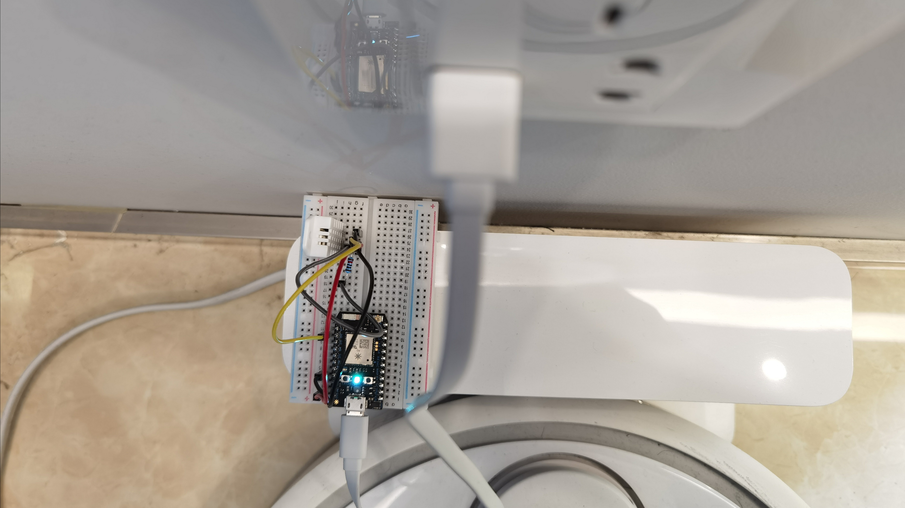
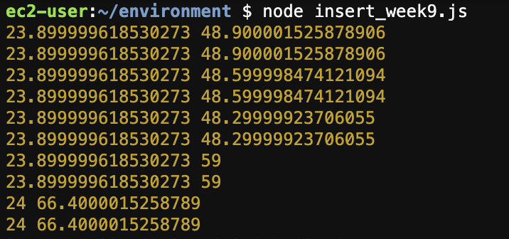
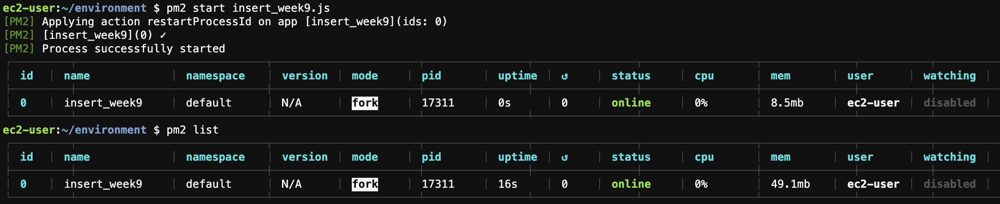

# Weekly Assignment 8 & 9

## My Photon
I accommodate my photon at a corner with an uninterruptible USB-A power with my robot vacuum. And an additional surprise I found was that even if my laptop is connecting to the 5G channel while my photon is connecting to 2.4G, they communicate perfectly.



## Data Capturing
I plan to collect two variables: Temperature and Humidity. I wrote nested requests to query the data from the particle API, 
```js
var getAndWriteData = function() {

    request(tempC_url, function(error, response, body1) {
        var tem = JSON.parse(body1).result;
        
        request(Humid_url, function(error, response, body2) {
            var hum = JSON.parse(body2).result;
            console.log(tem, hum);
        });
    });
};
```
I printed the results in console. And it looks great:


## Data Inserting
However, when I was trying to insert the data to PostgreSQL, errors happened. That looks like a promise problem. I tried to use the .catch(), but I couldn't figure it out. I don't want to give up on the humidity, so I left it here tentatively.

```console
ec2-user:~/environment $ node insert_week9.js
23.799999237060547 48.20000076293945
INSERT INTO sensorData VALUES (23.799999237060547, 48.20000076293945, DEFAULT);
(node:10401) UnhandledPromiseRejectionWarning: Error: connect ECONNREFUSED 127.0.0.1:5432
```

### Updated on Nov 28 2020
I spent tons of time debugging the code, I tested the code from all levels even directly used the starter code. And finally I found that the starter code missed `const dotenv = require('dotenv'); dotenv.config();`, so before I starting PM2, my code would fail to connect to the database and return the `UnhandledPromiseRejectionWarning`.

After confirming that my code is workable, I launched PM2 to run it in the background.



## Checking My Work
Luckily I finally make it several weeks before the final presentation. 
Below is the table returned:
`
┌─────────┬────────────────────┬────────────────────┬──────────────────────────┐
│ (index) │    temperature     │      humidity      │        sensortime        │
├─────────┼────────────────────┼────────────────────┼──────────────────────────┤
│    0    │        18.5        │ 54.70000076293945  │ 2020-11-28T09:13:24.068Z │
│    1    │        18.5        │ 54.79999923706055  │ 2020-11-28T09:13:28.558Z │
│    2    │        18.5        │ 54.79999923706055  │ 2020-11-28T09:13:32.074Z │
│    3    │        18.5        │ 54.900001525878906 │ 2020-11-28T09:13:37.290Z │
│    4    │        18.5        │ 54.900001525878906 │ 2020-11-28T09:13:44.280Z │
│    5    │        18.5        │         55         │ 2020-11-28T09:13:48.482Z │
│    6    │        18.5        │         55         │ 2020-11-28T09:13:51.604Z │
│    7    │        18.5        │ 55.20000076293945  │ 2020-11-28T09:24:04.175Z │
│    8    │ 18.399999618530273 │ 54.20000076293945  │ 2020-11-28T09:29:04.202Z │
└─────────┴────────────────────┴────────────────────┴──────────────────────────┘
┌─────────┬───────┐
│ (index) │ count │
├─────────┼───────┤
│    0    │  '9'  │
└─────────┴───────┘
`