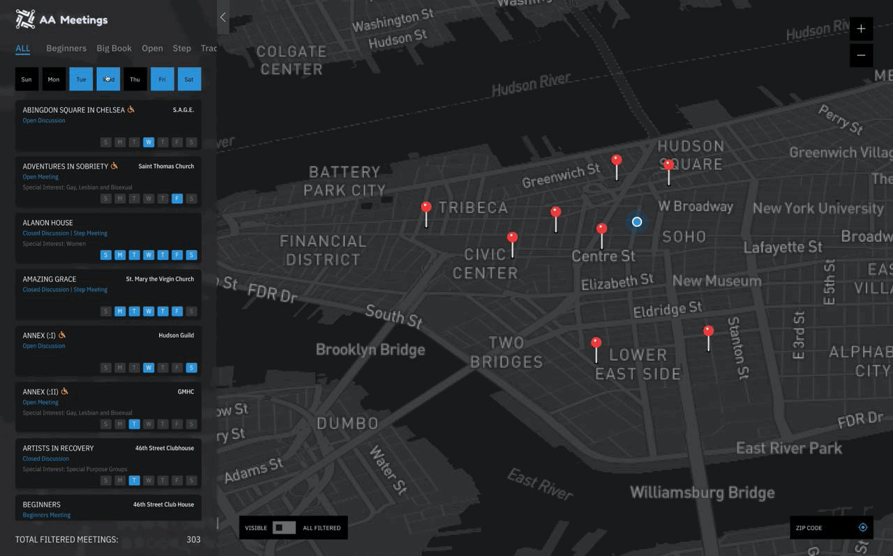

# Weekly Assignment 10

## Final Project 1: A.A. Meeting Platform
### Searching Strategy
1. Why I'm not using 'Search by distance'
2. Why I'm not using 'Search by date'

### Design
#### Panel Expanding

#### Data Points Status

#### Locating yourself

#### Filtered by Days

#### Selecting one of them

## Final Project 2: Blog Data

## Final Project 3: Sensor Data
This project aims to collect and display the temperature/humidity(T/H) data at my home through a DHT22 sensor.
### Glyph-based Visualization for Multidimensional Data
### Design Alternatives
1. The first version

This version of design visualized the difference between indoor and outdoor temperature and humidity. But it failed to support comparisons beyond the single box neither vertically nor horizontally.  

2. The second version  
 In this design, the website draws a scatter plot every two hours forming a microclimate landscape. Users can hover on one of them to reveal the connections across time and dates to see the changing trend. The TRANSPOSE function will help users switch the variables for the best comparison.

